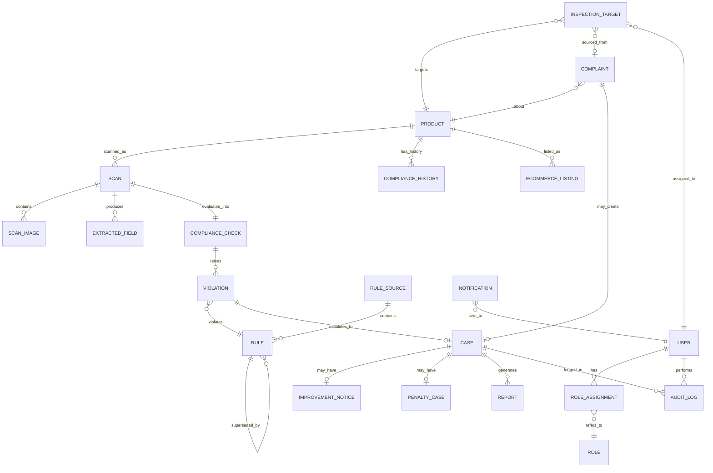

# 05 — Database Schema

PostgreSQL. All tables live under logical Django apps (see `03_Backend_Specification.md`) but the schema is described here as one unit since dashboards read across app boundaries constantly.

## Entity-Relationship Diagram

## Table definitions

### `users`
`id, name, email, phone, password_hash, is_active, created_at`

### `roles`
`id, name` — values: `citizen, field_officer, state_controller, national_admin, business, ecommerce_partner, rule_admin`

### `role_assignments`
`id, user_id (FK), role_id (FK), state (nullable, for officers/controllers), organization (nullable, for business/ecommerce)`

### `products` (Product Master)
`id, gtin_barcode (nullable), brand_name, product_name, category (food/electronics/medical_device/general/import), manufacturer_name, manufacturer_address, registered_by_business (FK users, nullable), created_at`

### `scans`
`id, product_id (FK, nullable until resolved), performed_by (FK users), role_context (citizen/officer), location (nullable), capture_method, status (pending/processed/reviewed), created_at`

### `scan_images`
`id, scan_id (FK), image_url, angle_type (front_panel/declaration_panel/close_up/barcode/wrap_around), quality_check_passed (bool), created_at`

### `extracted_fields`
`id, scan_id (FK), field_type (mrp/net_quantity/mfg_date/address/consumer_care/country_of_origin/license_no/...), extracted_value, confidence_score, font_size_mm (nullable), placement_zone (nullable)`

### `rule_sources`
`id, notification_no, title, gazette_url, published_date`

### `rules`
`id, rule_id_code (unique), section_ref, category, condition (JSONB), effective_from, effective_to (nullable), superseded_by_id (FK rules, nullable), status (draft/in_force/repealed), source_id (FK rule_sources)`

### `compliance_checks`
`id, scan_id (FK), verdict (compliant/non_compliant/needs_review), overall_confidence, evaluated_against_rule_set_date, reviewed_by_officer (FK users, nullable), created_at`

### `violations`
`id, compliance_check_id (FK), rule_id (FK), description, evidence_image_id (FK scan_images, nullable), created_at`

### `product_compliance_history`
`id, product_id (FK), violation_id (FK, nullable), is_first_time (bool, computed at write time), case_id (FK cases, nullable), created_at`

### `complaints`
`id, filed_by (FK users), product_id (FK), description, photo_urls (array), location, risk_score, routed_to_state (nullable), status, created_at`

### `inspection_targets`
`id, product_id (FK), assigned_to (FK users), source (risk_engine/complaint/ecommerce_flag), priority_score, complaint_id (FK, nullable), status (pending/in_progress/done), created_at`

### `cases`
`id, violation_id (FK, nullable), complaint_id (FK, nullable), product_id (FK), classification (first_time/repeat/fraud), status (open/notice_sent/rectification_window/verified/escalated/closed/appealed), opened_by (FK users), created_at, closed_at (nullable)`

### `improvement_notices`
`id, case_id (FK), issued_by (FK users), rectification_deadline, business_response (nullable), verified_by (FK users, nullable), outcome (pending/rectified/escalated)`

### `penalty_cases`
`id, case_id (FK), escalated_by (FK users), approved_by_controller (FK users, nullable), payment_status, appeal_status (none/filed/resolved)`

### `reports`
`id, case_id (FK), file_url, format (pdf/docx), signed (bool, stub for now), generated_at`

### `ecommerce_listings`
`id, platform_name, product_id (FK, nullable), raw_listing_data (JSONB), screening_result (compliant/flagged/pending), flagged_reason (nullable), created_at`

### `audit_logs`
`id, user_id (FK), action, target_type, target_id, metadata (JSONB), created_at`

### `notifications`
`id, user_id (FK), type, message, read (bool), created_at`

## Notes for implementation

- `condition` on `rules` and `raw_listing_data` on `ecommerce_listings` are JSONB — this is intentional, don't normalize rule conditions into separate columns; the rule engine reads/evaluates this JSON directly.
- `is_first_time` on `product_compliance_history` must be computed by querying prior rows for the same `product_id` (or same brand if no barcode match) at write time — this is the field the Improvement Notice vs. Penalty Case branch depends on.
- Every table that a dashboard displays must have createable seed fixtures — see `08_Rule_Engine_Dataset_Build_Instructions.md` for the `rules`/`rule_sources` seed approach; apply the same pattern (a versioned JSON/YAML fixture + a management command) for `products` and a handful of demo `scans`/`cases`.
