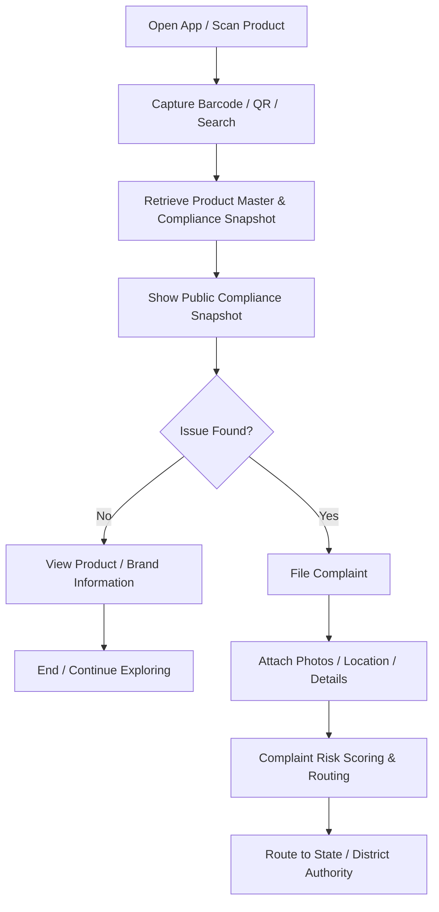
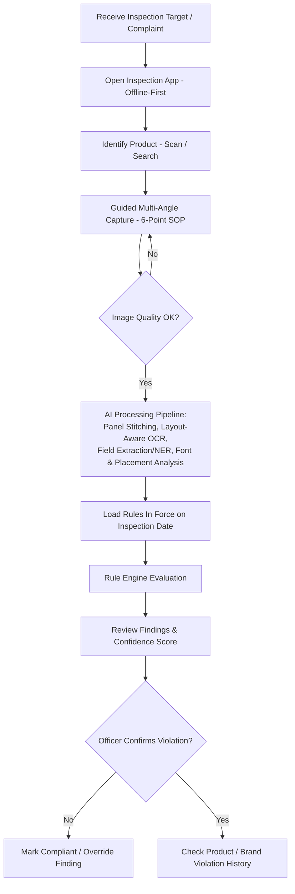
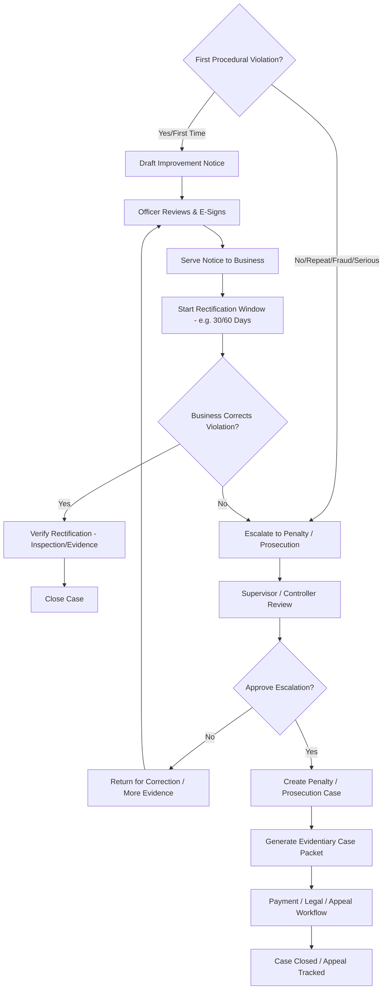
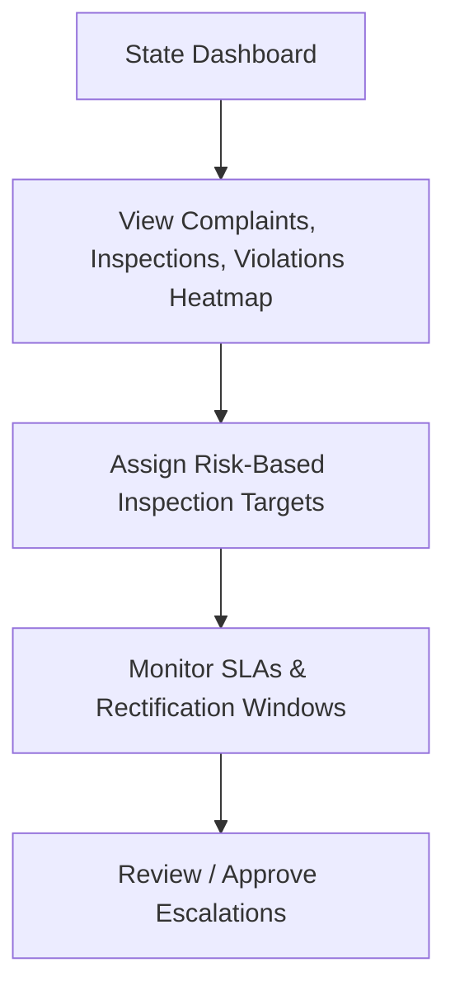
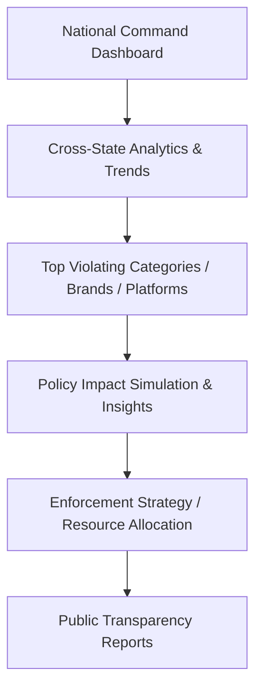
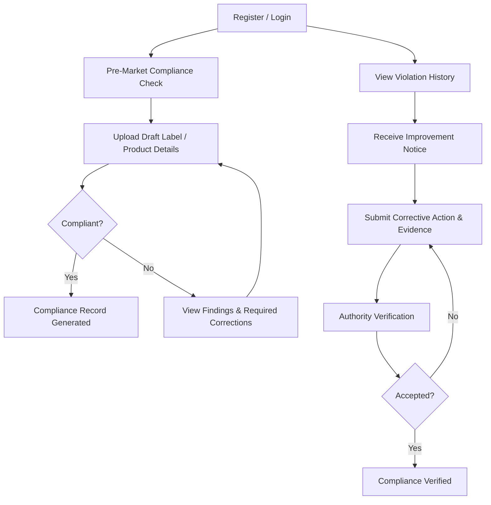
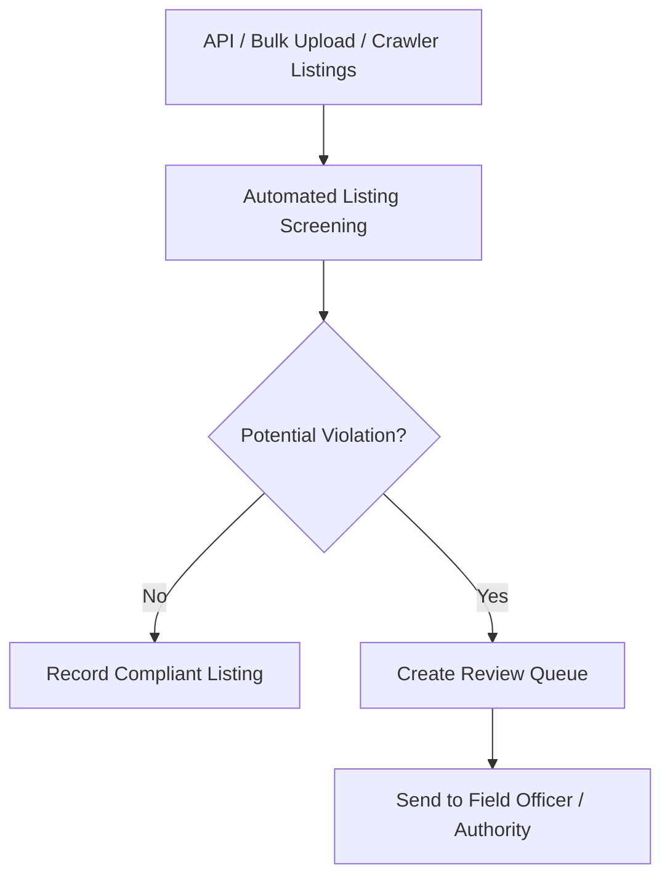
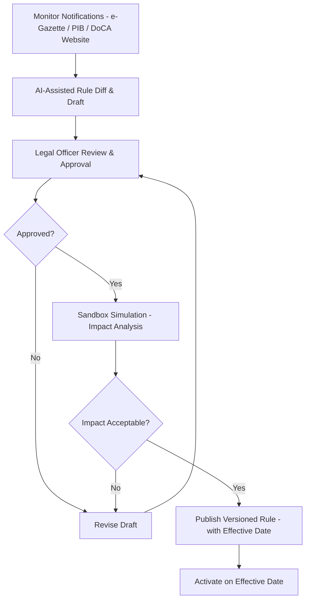

# 07 — User Flow Reference (Canonical)

Transcribed from the approved user-flow diagram. This is the single source of truth for what each dashboard must actually do — every screen listed here needs a corresponding backend endpoint and frontend view. Legend from the diagram: solid arrows = happy path, red arrows = exception/no branch, dashed arrows = cross-flow/integration between lanes.

## Lane 1 — Citizen / Consumer

## Lane 2 — Field Officer / Inspector

`B12` feeds directly into Lane 3 (Enforcement Flow, center panel) at "First Procedural Violation?"

## Lane 3 — Enforcement Flow (shared: Officer + Controller)

## Lane 4 — State Controller / Supervisory

`D5` connects into Lane 3 at `C10/C11`. `D3` connects back into Lane 2 at `B1` (inspection target assignment).

## Lane 5 — National Admin / DoCA Ministry

`E4` connects into Lane 7 (Rule Engine Admin) sandbox simulation. `E6` feeds Lane 1's public compliance snapshot.

## Lane 6 — Business Portal (Manufacturer / Importer / Seller)

`F8` is populated from Lane 3's `C5` (Serve Notice to Business). `F9`→`F10` feeds back into Lane 3's `C8` (Verify Rectification).

## Lane 7 — E-commerce Platform (Integration Partner)

`G6` feeds into Lane 2 at `B1` (inspection target).

## Lane 8 — Rule Engine Admin (Legal / Regtech)

`H9` feeds Lane 2's `B7` (Load Rules In Force on Inspection Date) and every other rule-evaluation point in the system.

## Shared National Data & Services Layer (footer — used by every lane)

- **Product Master** (GTIN / SKU / Brand)
- **Inspection & Compliance History** (versioned)
- **Rules & Amendments Repository** (versioned)
- **Document & Evidence Repository**
- **Analytics & Risk Engine** (insights)
- **Notifications & Communications**
- **Audit Logs & Digital Signatures**

Every dashboard's backend endpoints read from and write to this shared layer — never maintain a lane-local copy of Product Master, Rules, or Compliance History.

## Indirect Stakeholders / Integrations (not direct users, but data touchpoints)

- CCPA — dark-pattern / e-commerce escalations
- FSSAI — license / food compliance check
- BIS — certification verification
- CDSCO — medical device status
- National Consumer Helpline / Jagriti — grievance exchange
- Appellate Tribunal / Judiciary — receives case packets

These are integration points for Module 13 (Search/Retrieval & Cross-Regulator Checks) — build as stub API clients with the real contract, actual integration deferred per `06_Dashboard_Specs_All7.md`.
