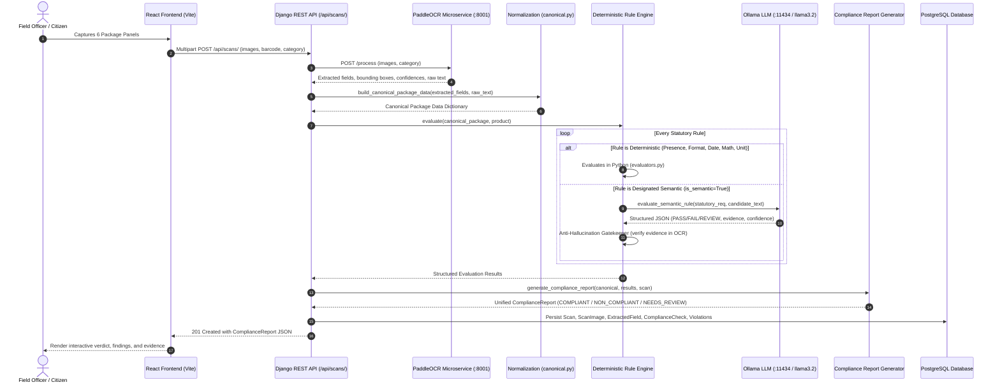

# MaapSetu Legal Metrology - System Architecture Document

## 1. System Overview

**MaapSetu** is an intelligent, high-assurance Legal Metrology compliance verification platform designed for field officers, state controllers, and citizens across India. It automates package label compliance checking against the **Legal Metrology (Packaged Commodities) Rules, 2011** and amendments.

The system enforces strict architectural boundaries:
- **Deterministic Rule Engine**: Sole source of truth for numeric math, required field presence, date logic, and statutory format validation.
- **Ollama LLM (Semantic Layer)**: Auxiliary linguistic reasoning for inherently ambiguous statutory clauses (e.g., generic commodity identification, complex address structures, consumer complaint contacts). The LLM is **never** permitted to evaluate math or override deterministic rules.
- **Authoritative Rules JSON**: `2011_rule.json` and `2026_rules.json` define statutory requirements.
- **Computer Vision / OCR Microservice**: High-accuracy evidence extraction preserving raw text and coordinates.
- **Presentation Layer**: Mobile-responsive React/Vite console with 6-panel guided camera alignment.

---

## 2. End-to-End Runtime Data Flow



---

## 3. Subsystem Architecture

### 3.1. Six-Camera Guided Capture Workflow
Packaged commodities require multi-surface inspection to view all statutory declarations. The frontend guides the user through 6 targeted steps:
1. **Front Principal Display Panel (PDP)**: Brand name, generic commodity identity, net quantity declaration.
2. **Mandatory Declaration Panel**: Month/year of manufacture, expiry/best-before, batch code, consumer care details.
3. **MRP & Net Quantity Close-Up**: Macro view of MRP statement (inclusive of all taxes) and metric unit symbols.
4. **Manufacturer & Packer Address**: Registered office/factory address, state, PIN code, country of origin.
5. **Barcode & EAN/GTIN**: 13-digit GS1 barcode scanning and verification.
6. **Package Wrap-Around & Seal**: Tamper-evident seals, outer carton integrity, seam legibility.

Each captured frame is tagged with its panel origin (`angle_type`) and forwarded to the backend for panel-associated OCR processing.

---

### 3.2. Canonical Normalization Layer (`canonical.py`)
Raw OCR output is probabilistic and noisy. The normalization layer bridges raw OCR and the compliance engine without destroying raw evidence.

Each field in the canonical representation maintains:
```json
{
  "raw": "MRP Rs. 349.00 (incl. of all taxes)",
  "normalized": {
    "amount": 349.0,
    "currency": "INR",
    "inclusive_of_taxes": true
  },
  "confidence": 0.98,
  "source_panel": "declaration_panel",
  "bbox": [120, 340, 480, 390],
  "detected": true,
  "normalization_status": "success",
  "ambiguity": null
}
```
Normalization statuses:
- `success`: Value parsed cleanly into structured format.
- `failed`: Text detected, but could not be parsed into statutory type.
- `ambiguous`: Conflicting declarations or low confidence.
- `not_detected`: Field was not present in OCR output.

---

### 3.3. Deterministic Compliance Rule Engine (`engine.py` & `evaluators.py`)
The rule engine evaluates canonical package data against the statutory rule set (`2011_rule.json` and `2026_rules.json`).

Key architectural principles:
1. **Never Assume Definite Absence from OCR Failure**:
   - If a mandatory field is not detected by OCR, its evaluation status is **`REVIEW`** (with `requires_human_review: True`).
   - A rule only evaluates to **`FAIL`** when the field is confirmed absent by officer inspection or when a detected value violates statutory rules (e.g. non-metric units, past expiry date, missing "inclusive of all taxes" statement).
2. **OCR Uncertainty Safety**:
   - Any declaration with OCR confidence `< 0.60` or marked as ambiguous is flagged for **`REVIEW`**, preventing false positives.
3. **Unit Validation & Math Accuracy**:
   - Enforces legal SI symbols (`g`, `kg`, `ml`, `l`). Non-standard units (e.g. `gms`, `kilo`, `mls`) trigger format violations.
   - Unit Sale Price (USP) arithmetic is validated with a 5-paise tolerance.

---

### 3.4. Semantic LLM Reasoning Layer (`providers.py` & `evaluator.py`)
For rules that cannot be resolved through deterministic patterns, the system queries a local Ollama model (`llama3.2`).

```
+-------------------------------------------------------------+
|               SEMANTIC LLM SAFETY ARCHITECTURE              |
+-------------------------------------------------------------+
|                                                             |
|  1. STRICT PROMPT CONSTRAINTS                               |
|     - Temperature = 0.0 (deterministic reasoning)           |
|     - format="json" (guaranteed valid JSON schema)          |
|     - Forbidden from performing math or unit checks         |
|                                                             |
|  2. PYDANTIC OUTPUT VALIDATION                              |
|     - Validates rule_id, status, confidence, evidence        |
|     - Invalid schema triggers automatic fallback to REVIEW  |
|                                                             |
|  3. ANTI-HALLUCINATION EVIDENCE GATEKEEPER                  |
|     - LLM-cited evidence MUST be verbatim in OCR text       |
|     - If evidence is fabricated -> downgraded to REVIEW     |
|                                                             |
|  4. CONFIDENCE THRESHOLDING (LLM_CONFIDENCE_THRESHOLD=0.70) |
|     - Confidence < 0.70 -> downgraded to REVIEW             |
|                                                             |
|  5. FAULT-TOLERANT DEGRADATION                              |
|     - If Ollama is offline or times out -> status: REVIEW   |
|     - Core application NEVER crashes                        |
+-------------------------------------------------------------+
```

---

### 3.5. Unified Compliance Report (`report.py`)
The report generator combines deterministic findings, semantic findings, and complete OCR evidence into a final structured report:

- **Overall Status Logic**:
  - `NON_COMPLIANT`: One or more confirmed violations exist.
  - `NEEDS_REVIEW`: No confirmed violations, but one or more declarations require visual officer verification or OCR was uncertain.
  - `COMPLIANT`: All applicable statutory declarations are present, valid, and verified.
- **Summary Metrics**: `total_rules`, `passed`, `failed`, `warnings`, `review_required`, `not_applicable`.
- **Finding Detail**: Includes rule ID, statutory section reference, detected value, expected condition, plain-language reason, source panel, confidence score, and raw bounding boxes.

---

### 3.6. Database Persistence Layer
PostgreSQL stores inspection lifecycles idempotently:
- `scans`: Header record with user, product, location, capture method, and canonical JSON.
- `scan_images`: High-resolution capture frames with panel classification.
- `extracted_fields`: Individual field detections with confidence and placement coordinates.
- `compliance_checks`: Overall inspection verdict, confidence, and complete `report_data` JSON.
- `violations`: Individual statutory infractions linked to the authoritative `Rule`.
- `product_compliance_history`: Historical ledger tracking repeat offenses for risk scoring.

---

## 4. Frontend & Mobile Network Architecture

```
[Mobile Phone Browser]
       │
       ▼ (Wi-Fi: http://172.20.10.14:5173)
[Vite Dev Server (0.0.0.0:5173)]
       │
       ├── Serves React 19 Application Bundles
       └── Proxies /api/* & /media/* requests
              │
              ▼
[Django REST Framework (0.0.0.0:8000)]
       │
       ├── Handles Authentication (JWT)
       ├── Runs Scan Pipeline
       └── Communicates with:
              ├── PostgreSQL (:5432)
              ├── OCR Service (:8001)
              └── Ollama LLM (:11434)
```

By leveraging Vite's reverse proxy, mobile devices connect directly through port `5173` without encountering CORS blocks, port routing complications, or hardcoded IP bindings.
